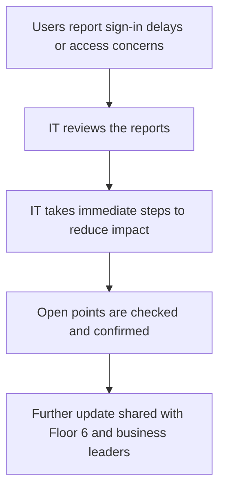

# Floor 6 Incident Partner Update

## Version Header
- Title: Floor 6 Incident Partner Update
- Version: 1.0
- Date: 14/08/2026
- Author: Vamsi
- Status: Business Communication Draft

## 1. What Happened
Early Monday morning, some people on Floor 6 told us they could not sign in, while others said it was taking much longer than normal to start work. This has affected work on that floor and may have disrupted lawyers, support staff, and team managers.

We also received a separate report that client-related information appeared when it was not expected. We are treating that report seriously. At the moment, we know these reports were made and that they appear to be limited to Floor 6, but we do not yet know whether they are connected or whether they are separate issues.

## 2. What We Are Doing
IT is working to reduce the impact on people who are affected while we continue to review the situation. We are looking closely at the recent change made for Floor 6, checking who has been affected, and taking careful steps to stop the issue from spreading if that recent change turns out to be part of the problem.

At the same time, we are reviewing the separate information-access concern as a priority so we can confirm the facts and decide whether any further action is needed. Our focus is to help users as quickly as possible while making sure our decisions are based on confirmed information.

## 3. What Remains Open
There are still some important questions we need to answer. We are still confirming why some people could not sign in, why others saw long delays, and whether this is one issue or more than one issue happening at the same time.

We are also checking whether the recent software change for Floor 6 is only linked by timing or whether it played a direct part in the disruption. We are also reviewing the separate report about unexpected client-related information before reaching any conclusion. More review is needed because we want to separate confirmed facts from early reports before giving a final answer.

## 4. What Users Should Do
If you are affected, please continue to report the issue through the Service Desk. Please include your name, where you are based, your device name if you know it, and a short note explaining what happened and when it happened.

We will share another update once we have confirmed whether the steps already under way have reduced the impact and whether any wider message is needed. We understand this is important, and we will continue to provide clear and simple updates as soon as we have confirmed information to share.

Simple view of the current position:

